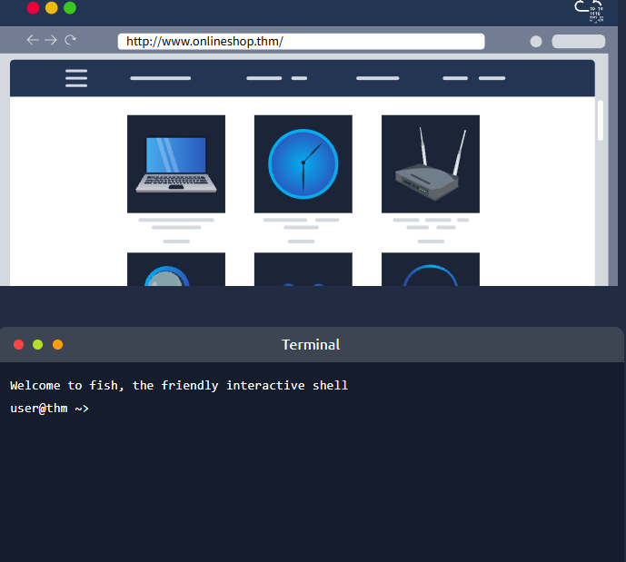
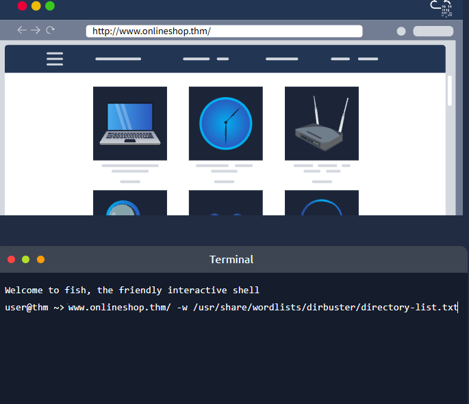
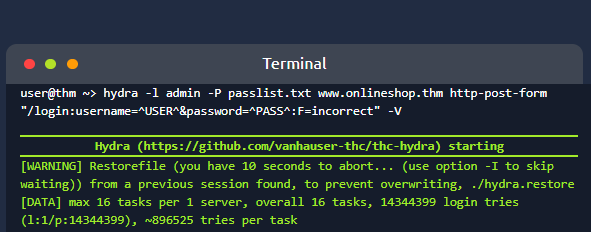
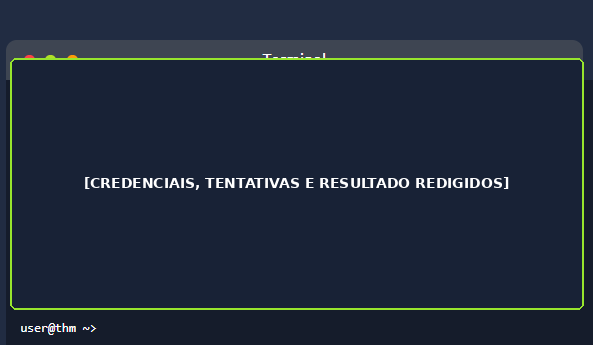

# Análise de Superfície Web e Auditoria de Autenticação

## 1. Resumo executivo

Este projeto documenta um laboratório autorizado do TryHackMe envolvendo **descoberta de conteúdo web** e **avaliação controlada de autenticação**. A atividade combinou reconhecimento de uma aplicação fictícia, preparação de enumeração com Gobuster, análise de um formulário HTTP POST e auditoria controlada com Hydra.

O principal aprendizado foi interpretar as etapas como uma cadeia de risco: a descoberta de um endpoint não é, por si só, uma vulnerabilidade, mas uma credencial fraca, tentativas repetidas sem restrição suficiente e baixa visibilidade operacional podem aumentar a possibilidade de acesso indevido. A documentação enfatiza a perspectiva defensiva e a relevância dos sinais para triagem e detecção em SOC.

## 2. Escopo e autorização

O ambiente analisado é **fictício, isolado e autorizado**, disponibilizado pelo TryHackMe para fins educacionais. Nenhuma atividade foi realizada contra sistemas reais, terceiros ou ativos fora do escopo do laboratório.

As credenciais, flags e respostas específicas foram removidas ou redigidas. O projeto possui finalidade exclusivamente educacional e não constitui autorização para testar aplicações públicas ou sistemas de terceiros.

## 3. Cenário

O laboratório apresentou uma aplicação web cuja superfície precisava ser analisada antes de uma publicação hipotética. A navegação visível não representava necessariamente todo o conteúdo disponível, e o fluxo de autenticação precisava ser compreendido para avaliar controles contra tentativas automatizadas.

A análise foi conduzida em duas frentes relacionadas: primeiro, a preparação da descoberta de conteúdo e de rotas não referenciadas; depois, a observação do formulário de login e de seu comportamento diante de tentativas controladas. O cenário permitiu relacionar reconhecimento, autenticação e telemetria sem extrapolar o que as evidências demonstram.

## 4. Objetivos

Os objetivos do laboratório foram:

- Reconhecer a aplicação e sua navegação disponível.
- Identificar conteúdo não referenciado na interface principal.
- Compreender a enumeração automatizada de caminhos com uma wordlist controlada.
- Analisar o formulário de autenticação baseado em HTTP POST.
- Avaliar tentativas repetidas de autenticação em um ambiente autorizado.
- Relacionar o comportamento observado a controles de prevenção, monitoramento e resposta de um SOC.

## 5. Ferramentas

| Ferramenta ou componente | Utilização no laboratório |
| --- | --- |
| TryHackMe | Ambiente fictício, isolado e autorizado para o exercício. |
| Linux | Sistema utilizado para as atividades de terminal e registro técnico. |
| Gobuster | Preparação da descoberta automatizada de conteúdo web. |
| Hydra | Auditoria controlada do formulário de autenticação. |
| Wordlists | Listas reduzidas de caminhos e senhas fornecidas pelo laboratório. |
| Navegador | Reconhecimento visual, navegação e verificação controlada de rotas. |
| Formulário HTTP POST | Fluxo de autenticação analisado durante a auditoria. |

## 6. Metodologia

A metodologia foi estruturada para separar reconhecimento, validação e análise defensiva:

1. Reconhecimento inicial da aplicação e identificação da navegação disponível.
2. Verificação controlada de caminhos previstos no exercício, sem atribuir resultados que não estivessem visíveis.
3. Preparação da enumeração com Gobuster e uma wordlist de diretórios.
4. Identificação do endpoint de autenticação.
5. Análise dos campos, método HTTP POST e mensagens de resposta do formulário.
6. Auditoria controlada com Hydra utilizando uma lista reduzida do laboratório.
7. Registro e sanitização das evidências antes da publicação.
8. Análise defensiva do comportamento e dos sinais relevantes para SOC.

Os comandos abaixo são apenas modelos generalizados, sem credenciais reais e sem um alvo operacional:

```bash
gobuster dir --url http://<ALVO_AUTORIZADO>/ -w <WORDLIST>
```

```bash
hydra -l <USUARIO_TESTE> -P <WORDLIST> <ALVO_AUTORIZADO> \
http-post-form "/login:username=^USER^&password=^PASS^:F=<MENSAGEM_FALHA>" -V
```

## 7. Evidências

As quatro imagens abaixo foram extraídas da versão sanitizada do relatório. As capturas originais não foram publicadas. A quarta evidência possui uma faixa escura cobrindo usuário, senha válida, tentativas, resultado sensível, flags e respostas do laboratório.

### 7.1 Ambiente autorizado



*Figura 1 — A captura estabelece o cenário educacional, mostrando uma aplicação web fictícia e um terminal de laboratório. Ela não representa um sistema real nem uma autorização fora do TryHackMe.*

### 7.2 Preparação da enumeração



*Figura 2 — A imagem registra somente a preparação da enumeração com a wordlist. Ela não comprova um resultado completo do Gobuster nem permite atribuir rotas específicas.*

### 7.3 Auditoria controlada com Hydra



*Figura 3 — A captura mostra a inicialização do Hydra no ambiente autorizado, preservando o alvo fictício, a wordlist e o módulo de formulário, sem publicar senhas candidatas.*

### 7.4 Resultado sanitizado



*Figura 4 — O conteúdo sensível foi integralmente coberto pela faixa `[CREDENCIAIS, TENTATIVAS E RESULTADO REDIGIDOS]`. Nenhum usuário, senha, tentativa, resultado, flag ou resposta é publicado.*

## 8. Achados técnicos

A análise documentou os seguintes achados dentro do cenário autorizado:

- **Endpoint de autenticação identificado:** a rota pôde ser alcançada durante a descoberta, o que amplia a superfície observável, mas não constitui vulnerabilidade isolada.
- **Credencial fraca no cenário:** uma combinação presente em uma lista curta permitiu concluir a autenticação do exercício.
- **Tentativas repetidas aceitas:** a ferramenta conseguiu processar uma sequência de entradas até identificar um resultado válido dentro do laboratório.
- **Controles insuficientes contra password guessing:** a ausência ou insuficiência de limitação de frequência e bloqueio progressivo aumenta o risco de automação.
- **Telemetria defensiva necessária:** falhas repetidas e eventual sucesso posterior devem gerar sinais para investigação e resposta.

> A descoberta de uma página de login não representa, isoladamente, uma vulnerabilidade. Ocultar uma rota não substitui autenticação, autorização, rate limiting, MFA e monitoramento.

## 9. Cadeia de risco

```text
Reconhecimento
→ Descoberta do endpoint
→ Análise do formulário
→ Tentativas controladas
→ Possibilidade de acesso indevido
```

A cadeia não significa que toda descoberta resulte em comprometimento. O risco aumenta quando uma senha previsível pode ser testada repetidamente e a operação não dispõe de controles ou alertas capazes de interromper e investigar o comportamento.

## 10. Recomendações defensivas

As recomendações devem combinar prevenção, detecção e resposta em camadas:

- Exigir **MFA**, principalmente para contas administrativas e acessos de maior risco.
- Aplicar política de senhas fortes e bloquear senhas comuns ou comprometidas.
- Implementar **rate limiting** por conta, origem, dispositivo e janela de tempo.
- Aplicar bloqueio progressivo sem criar uma condição de negação de serviço fácil de explorar.
- Utilizar CAPTCHA adaptativo após comportamento suspeito, sem depender dele como único controle.
- Adotar mensagens de erro genéricas para não indicar qual fator de autenticação falhou.
- Registrar autenticações com horário, origem, conta, user-agent, sessão e decisão do controle.
- Criar alertas para falhas repetidas, múltiplas origens contra uma conta e sucesso após várias falhas.
- Integrar os logs ao SIEM para correlação e investigação.
- Revisar contas padrão, inativas e privilegiadas, além de remover conteúdo web antigo ou não referenciado.

## 11. Perspectiva SOC

Uma operação SOC poderia monitorar e correlacionar os seguintes sinais:

| Sinal | Exemplo de observação | Ação inicial |
| --- | --- | --- |
| Muitas falhas contra a mesma conta | Vários POST para `/login` com falha em uma janela curta. | Validar origem, conta, frequência e reputação. |
| Grande volume de POST para `/login` | Crescimento anormal de requisições ao endpoint. | Verificar automação, limitar frequência e preservar evidências. |
| Uma origem tentando várias combinações | Uma origem testa diversas senhas ou contas em sequência. | Investigar a origem e conter quando necessário. |
| Muitas origens atacando a mesma conta | Várias origens tentam autenticar a mesma identidade. | Avaliar password spraying e proteger a conta. |
| Login bem-sucedido após várias falhas | Sucesso imediatamente após uma sequência anormal de erros. | Tratar como possível comprometimento e escalar. |
| Mudança de contexto após tentativas | Novo IP, dispositivo, user-agent ou localização. | Revalidar a sessão, exigir MFA e revisar atividade. |

O fluxo de triagem deve confirmar se o alerta corresponde a produção, teste autorizado ou falso positivo; preservar horário, origem, conta, endpoint e user-agent; verificar atividade posterior; conter quando necessário; escalar conforme o privilégio e o impacto; e documentar decisões e responsáveis.

## 12. Mapeamento

| Referência | Relação com o cenário |
| --- | --- |
| OWASP A07:2021 — Identification and Authentication Failures | Falhas de identificação e autenticação, incluindo senhas fracas e proteção insuficiente contra automação. |
| CWE-307 — Improper Restriction of Excessive Authentication Attempts | Restrição inadequada de tentativas excessivas de autenticação. |
| CWE-521 — Weak Password Requirements | Requisitos insuficientes para escolha e uso de senhas fortes. |
| MITRE ATT&CK T1110.001 — Password Guessing | Tentativa de identificar uma senha válida para uma conta conhecida. |

## 13. Competências demonstradas

O projeto demonstra competências em:

- Enumeração de conteúdo web.
- Uso de Gobuster.
- Uso controlado de Hydra.
- Interpretação de formulário HTTP POST.
- Análise de autenticação.
- Password guessing em laboratório autorizado.
- Análise de risco e cadeia de impacto.
- Registro e sanitização de evidências.
- Recomendações defensivas.
- Pensamento analítico voltado para SOC.
- Documentação técnica.

## 14. Limitações

A captura de preparação do Gobuster não apresenta o comando completo nem seus resultados; por isso, nenhuma rota específica foi atribuída a essa imagem. A wordlist era reduzida e fornecida pelo laboratório. Nenhum teste foi realizado fora do escopo autorizado, e nenhum resultado não demonstrado pelas evidências foi inventado.

Além disso, a documentação não avalia controles que não estavam disponíveis no cenário, não comprova impacto em sistemas reais e não deve ser interpretada como uma auditoria de produção.

## 15. Relatório completo

<a href="./relatorio-auditoria-autenticacao-web.pdf"><strong>Acessar relatório completo em PDF</strong></a>

O PDF foi recebido pronto, revisado e sanitizado. Seu conteúdo e sua identidade visual não foram alterados.

## Referência documental

[1]: ./relatorio-auditoria-autenticacao-web.pdf "Relatório de Análise de Superfície Web e Auditoria de Autenticação"

O conteúdo deste README e as descrições das evidências são baseados no relatório técnico anexado ao projeto [1].

> Todos os testes descritos foram realizados exclusivamente em ambiente educacional autorizado. Não teste sistemas reais ou de terceiros sem autorização explícita.
