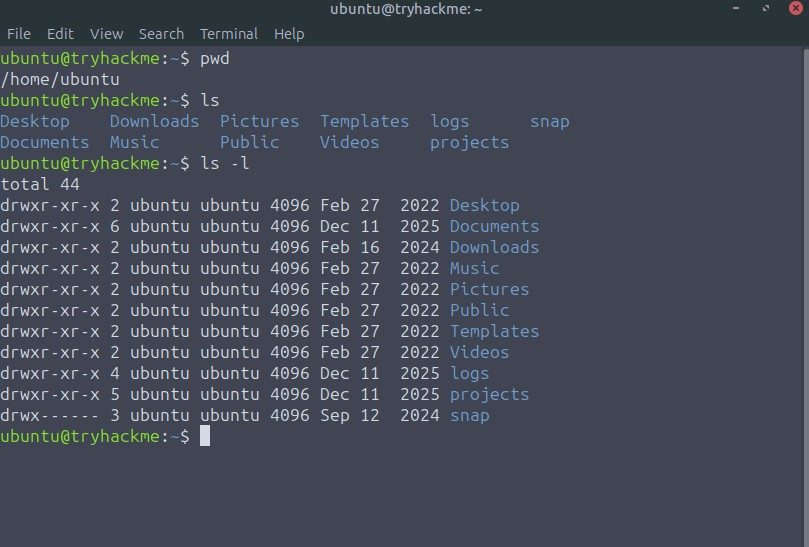
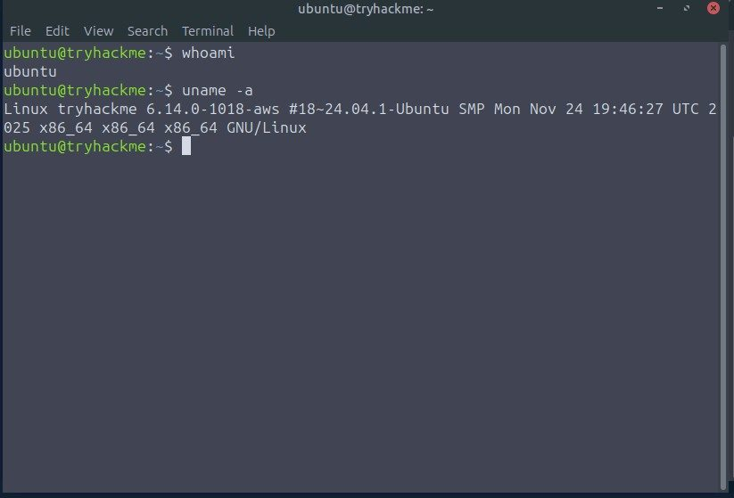
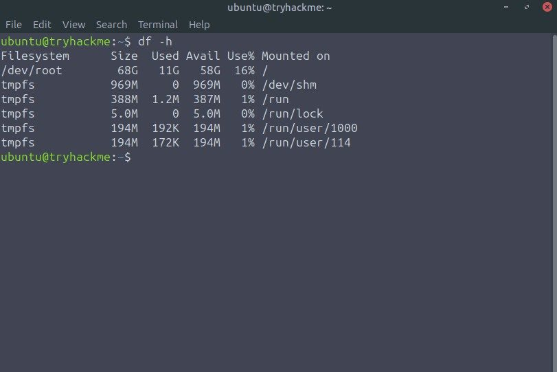

# Operação e Diagnóstico em Linux via CLI

Relatório técnico sobre navegação no sistema de arquivos, busca de arquivos e coleta de informações de um ambiente Linux por meio da linha de comando.

## Objetivo

Desenvolver autonomia para operar um ambiente Linux pela CLI, praticando tarefas essenciais de suporte, troubleshooting e coleta inicial de evidências para operações de tecnologia e segurança.

## Atividades realizadas

- Uso do terminal Linux para executar comandos e interpretar resultados.
- Navegação pelo sistema de arquivos com pwd, ls e ls -l.
- Localização de arquivos com o comando find.
- Identificação do usuário atual com whoami.
- Verificação da versão do kernel e das informações do sistema com uname.
- Análise do uso de armazenamento com df.
- Registro dos comandos e dos resultados observados no laboratório.

## Resultado e aprendizado

A prática consolidou um fluxo básico de diagnóstico: confirmar o contexto atual, compreender a estrutura de diretórios, localizar evidências, identificar o sistema e avaliar recursos disponíveis. Essas etapas formam uma base útil para suporte, troubleshooting e investigação inicial em ambientes Linux.

## Evidências visuais

*Execução de pwd, ls e ls -l para confirmar o diretório de trabalho e visualizar sua estrutura.*

*Uso de whoami e uname para identificar o contexto da sessão e as informações do sistema.*

*Leitura do uso, disponibilidade e pontos de montagem com df -h.*

## Ferramenta e cenário

O exercício simulou o primeiro dia de atuação em uma equipe de operações cibernéticas e foi baseado no módulo de Linux da **plataforma TryHackMe**. As imagens publicadas mostram apenas comandos e dados genéricos do ambiente educacional.

## Competências demonstradas

**Linux**, linha de comando, navegação de diretórios, busca com find, identificação de usuário e sistema, análise de armazenamento, coleta de informações e documentação operacional.

## Documentação

- [Baixar relatório técnico original em PDF](./relatorio-fundamentos-linux-cli.pdf)
- [Voltar ao catálogo de projetos](../README.md)
