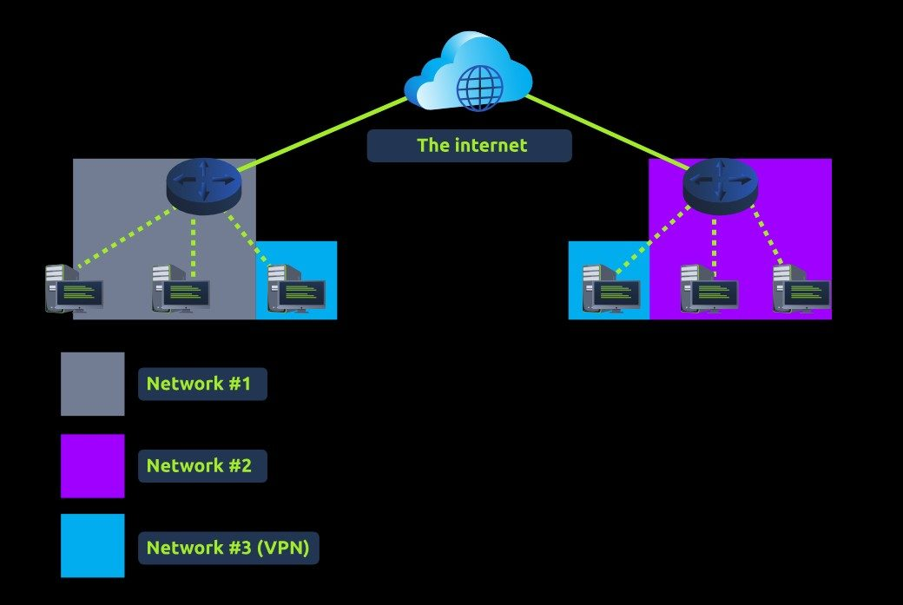
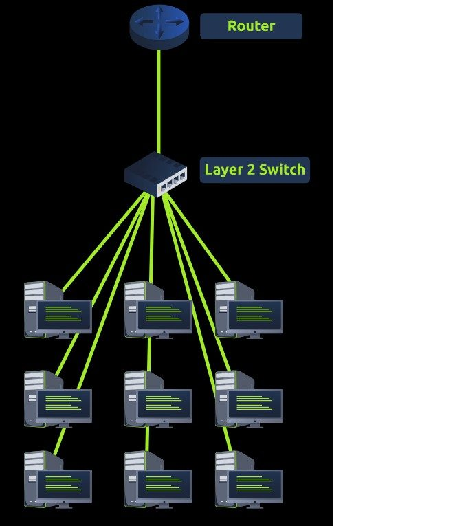

# Análise de Redes, Firewall, VPN e VLAN

Laboratório técnico de conectividade, controle de tráfego e segmentação de redes em um simulador educacional.

## Objetivo

Consolidar os fundamentos necessários para compreender a comunicação entre redes, a filtragem de tráfego e a segmentação de ambientes. O projeto relaciona conceitos de infraestrutura e segurança de redes a cenários práticos de conectividade entre dispositivos.

## Atividades realizadas

- Análise do encaminhamento de portas para disponibilizar um serviço fora da rede local.
- Comparação entre encaminhamento de portas e regras de firewall.
- Estudo dos modelos stateful e stateless de firewall e criação de regra de bloqueio de tráfego malicioso.
- Revisão do funcionamento de redes privadas virtuais e das principais tecnologias de VPN.
- Identificação das funções de roteadores, switches e gateways.
- Estudo de VLANs e de sua aplicação na segmentação lógica de redes.
- Exercício prático de comunicação entre redes, observando ARP e o estabelecimento de uma conexão TCP.

## Resultado e aprendizado

A prática permitiu observar como roteamento, switching, firewalls, VPNs e VLANs se complementam para controlar o fluxo de pacotes e organizar a comunicação entre segmentos. O laboratório reforçou a importância de validar regras, topologias e caminhos de rede durante troubleshooting.

## Evidências visuais

*Representação de redes interligadas por uma VPN e conectadas à Internet.*

*Topologia de acesso com roteador, switch de camada 2 e dispositivos finais.*

## Ferramenta e cenário

O relatório foi desenvolvido na **plataforma TryHackMe**, com apoio de um simulador de rede para observar o fluxo de pacotes, as regras de filtragem e a comunicação entre dispositivos em redes distintas.

## Competências demonstradas

**Redes de computadores**, TCP/IP, encaminhamento de portas, firewalls stateful e stateless, VPN, roteamento, switching, ARP, handshake TCP, VLAN e fundamentos de segurança de redes.

## Documentação

- [Baixar relatório técnico original em PDF](./relatorio-fundamentos-redes.pdf)
- [Voltar ao catálogo de projetos](../README.md)
