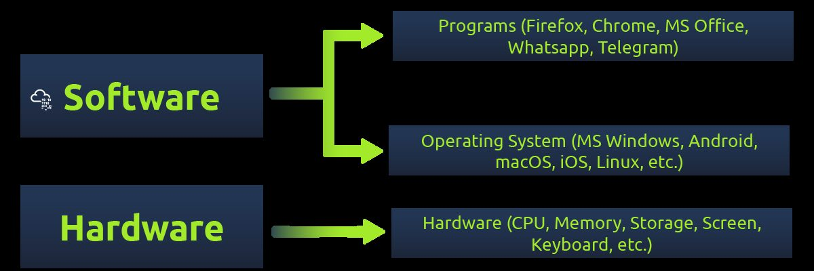
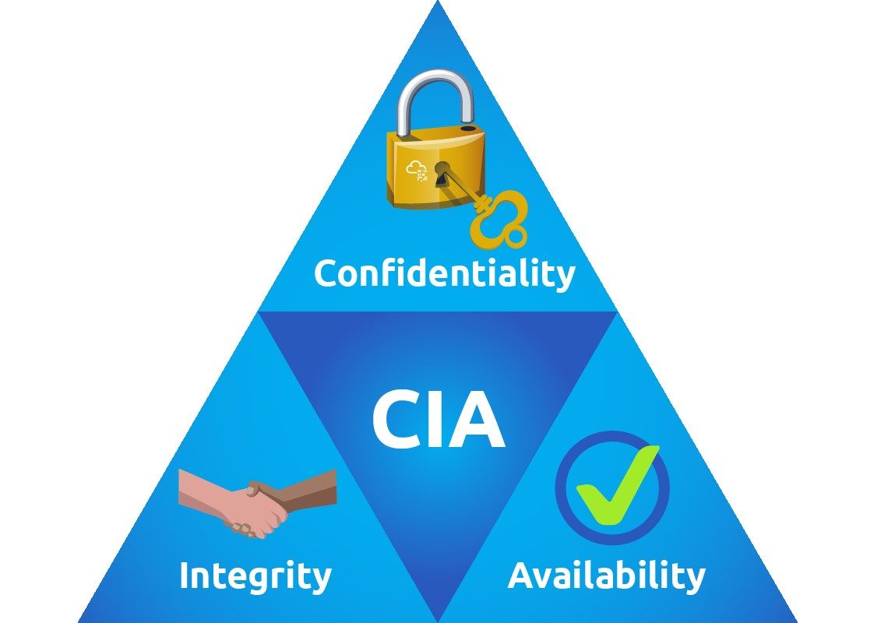

# Investigação de Segurança em Sistemas Linux

Estudo de caso autorizado sobre autenticação, exposição acidental de credenciais e escalonamento controlado de privilégios em um ambiente de laboratório.

## Objetivo

Investigar como falhas de autenticação e o armazenamento inadequado de informações sensíveis podem permitir acesso inicial indevido e posterior elevação de privilégios. O exercício também relaciona os fundamentos de sistemas operacionais à confidencialidade, integridade e disponibilidade.

## Atividades realizadas

- Revisão dos fundamentos de hardware, software e sistemas operacionais.
- Análise de vulnerabilidades relacionadas a credenciais fracas, reutilização de senhas e permissões.
- Reconhecimento do ambiente e autenticação em um serviço SSH de laboratório.
- Investigação do histórico de comandos para identificar exposição acidental de credenciais.
- Demonstração controlada do impacto do escalonamento de privilégios.
- Registro das observações e elaboração de recomendações de mitigação.

## Resultado e aprendizado

O laboratório demonstrou que falhas simples de higiene operacional podem comprometer uma cadeia de acesso. A análise reforçou a necessidade de autenticação forte, proteção de credenciais, princípio do menor privilégio, revisão de permissões e documentação cuidadosa de incidentes.

Os detalhes operacionais sensíveis e eventuais respostas de desafio não são reproduzidos neste README. As imagens abaixo foram selecionadas do relatório sem publicar flags, credenciais, tokens, chaves ou dados pessoais.

## Evidências visuais

*Conceitos de hardware, sistema operacional e software considerados na análise do ambiente.*

*Confidencialidade, integridade e disponibilidade como critérios de análise do caso.*

## Ferramenta e cenário

O laboratório foi realizado na **plataforma TryHackMe**, em ambiente controlado e autorizado, simulando uma avaliação de segurança para um cliente fictício. O conteúdo foi documentado com foco educacional e sem interação com sistemas de terceiros.

## Competências demonstradas

**Segurança de sistemas Linux**, autenticação, SSH, análise de exposição de credenciais, princípio do menor privilégio, investigação técnica, hardening e documentação de incidentes.

## Documentação

- [Baixar relatório técnico original em PDF](./relatorio-seguranca-sistemas-operacionais.pdf)
- [Voltar ao catálogo de projetos](../README.md)

> Laboratório executado exclusivamente em ambiente autorizado para estudo e desenvolvimento profissional. Credenciais, flags e respostas de desafios não são publicados.
