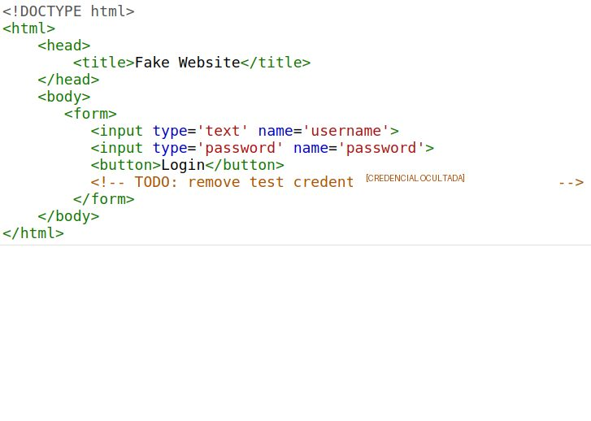
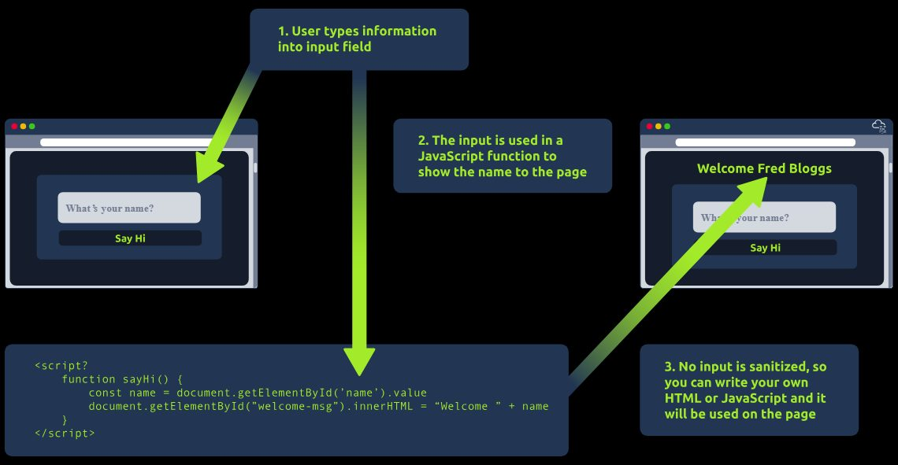
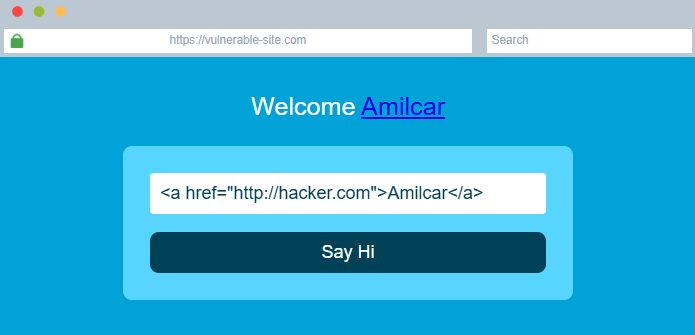

# Análise de Segurança Web no Front-end

Este projeto documenta um laboratório autorizado do TryHackMe sobre **HTML, JavaScript, inspeção de código-fonte, exposição de dados sensíveis e HTML Injection**. O estudo relaciona o funcionamento do modelo cliente-servidor com os riscos de confiar em informações ou entradas que chegam ao navegador.

## Contexto

O laboratório foi realizado em uma aplicação web educacional e vulnerável, com foco no que o navegador recebe, interpreta e renderiza. A análise considerou a comunicação entre navegador e servidor, a estrutura dos documentos HTML, a manipulação do DOM e o tratamento de dados inseridos pelo usuário no front-end.

A atividade também reforçou uma distinção importante para operações de segurança: ocultar um elemento na interface não protege o dado. Qualquer segredo enviado ao navegador pode ser inspecionado pelo usuário e deve permanecer sob controle do back-end.

## Objetivo

O objetivo foi compreender o fluxo de uma aplicação web, analisar HTML e JavaScript com ferramentas de desenvolvedor, identificar credenciais de teste expostas em um comentário HTML, validar de forma controlada uma vulnerabilidade de HTML Injection e registrar recomendações defensivas. O escopo não foi um pentest profissional nem um teste em sistema real.

## Ambiente e ferramentas

O trabalho foi executado exclusivamente no ambiente educacional autorizado do **TryHackMe**, utilizando um navegador web e suas ferramentas de desenvolvedor para inspeção de elementos, código-fonte e comportamento da página. As tecnologias e conceitos observados foram HTML, JavaScript, DOM, `document.getElementById`, `innerHTML`, `textContent`, comentários HTML, codificação de saída e sanitização de entradas.

## Atividades realizadas

As atividades foram organizadas para conectar fundamentos de desenvolvimento web a práticas de análise defensiva:

1. Compreensão da comunicação entre navegador e servidor, incluindo o envio de requisições e o recebimento dos recursos utilizados na renderização.
2. Análise da estrutura de documentos HTML, seus elementos, atributos, identificadores, classes, formulários e comentários.
3. Manipulação controlada de elementos HTML em uma página de laboratório para observar a relação entre código e conteúdo renderizado.
4. Uso de JavaScript e da propriedade `innerHTML` para compreender a manipulação dinâmica do DOM.
5. Inspeção do código-fonte com as ferramentas de desenvolvedor, incluindo elementos de uma página de autenticação.
6. Identificação de credenciais de teste expostas em um comentário HTML, mantendo os valores ocultados no registro público.
7. Validação controlada de uma vulnerabilidade de HTML Injection, observando a interpretação de uma tag de link inserida por uma entrada controlada.
8. Análise do impacto e recomendação de controles defensivos para reduzir exposição de dados, interpretação indevida de marcação e abuso de entradas.

## Achados de segurança

### Exposição de dados sensíveis no front-end

Credenciais de teste foram identificadas em um comentário HTML durante a inspeção do código-fonte. Segredos enviados ao navegador podem ser recuperados por qualquer usuário com acesso à página, mesmo quando não aparecem visualmente na interface. Por esse motivo, senhas, tokens e chaves não devem ser armazenados no código entregue ao cliente; devem permanecer no back-end, ser removidos da publicação e invalidados quando houver exposição.

O achado representa uma falha de controle de informação no front-end, não uma comprovação de acesso a sistema real. A evidência publicada mantém as ocultações já existentes no relatório e não reproduz os valores específicos do laboratório.

### HTML Injection

Uma entrada controlada pelo usuário foi inserida na página por meio de `innerHTML` sem tratamento adequado. Uma tag de link foi interpretada pelo navegador, confirmando que a aplicação permitia a inserção de marcação HTML não prevista no conteúdo renderizado.

O impacto observado foi a alteração do conteúdo visual da página e a criação de um elemento de link. A mitigação deve considerar o contexto de saída: para exibir texto, `textContent` é normalmente mais seguro porque não interpreta tags HTML; quando HTML for realmente necessário, a aplicação deve aplicar validação e sanitização restritivas.

> O laboratório comprovou HTML Injection, mas não comprovou execução de JavaScript injetado. Portanto, o resultado não deve ser apresentado como XSS.

## Evidências

As imagens abaixo foram extraídas exclusivamente do relatório recebido. As capturas foram selecionadas por relevância técnica, mantêm as ocultações originais e não expõem nomes de usuário, senhas, flags, respostas, tokens ou outras credenciais.

*Inspeção do código-fonte da página de autenticação com o valor da credencial de teste preservado como ocultado.*

*Fluxo didático que mostra a entrada controlada, o processamento JavaScript e a renderização sem sanitização adequada.*

*Resultado observado no laboratório: a aplicação interpretou a marcação HTML e renderizou um link na mensagem da página.*

## Controles recomendados

| Controle | Aplicação defensiva | Risco reduzido |
| --- | --- | --- |
| Codificação de saída | Converter caracteres especiais conforme o contexto antes de exibir dados do usuário. | Interpretação de tags injetadas. |
| Uso de `textContent` | Preferir APIs que exibam texto sem interpretar marcação HTML quando HTML não for necessário. | HTML Injection em conteúdo textual. |
| Sanitização | Permitir somente tags e atributos necessários quando a aplicação realmente precisar aceitar HTML. | Conteúdo ativo ou perigoso. |
| Segredos no back-end | Nunca incluir senhas, tokens ou chaves no front-end; remover e invalidar valores expostos. | Exposição de dados sensíveis. |
| Autorização no servidor | Validar autenticação e permissões no back-end para cada operação e recurso. | Acesso indevido por informações expostas no cliente. |
| Content Security Policy | Restringir origens e tipos de conteúdo como camada adicional de proteção. | Impacto de injeções e carregamentos externos. |
| Revisão e monitoramento | Inspecionar código, comentários e dependências antes da publicação e registrar entradas suspeitas. | Reincidência e detecção tardia de abuso. |

## Competências demonstradas

O projeto demonstra compreensão de arquitetura cliente-servidor, leitura de HTML, uso de ferramentas de desenvolvedor, manipulação básica do DOM, análise de JavaScript, inspeção de código-fonte, identificação de exposição de dados sensíveis, validação controlada de HTML Injection, análise de impacto, recomendação de controles defensivos e documentação técnica com evidências.

## Documentação

- [Relatório técnico completo em PDF](./relatorio-seguranca-web-front-end.pdf)

## Escopo ético

Todos os testes descritos foram realizados exclusivamente no cenário vulnerável e autorizado do TryHackMe. Nenhuma aplicação pública, sistema de terceiros ou ambiente sem permissão foi testado. As evidências publicadas preservam as ocultações do relatório e não devem ser utilizadas para testar sistemas sem autorização explícita.

## Referências

[1]: ./relatorio-seguranca-web-front-end.pdf "Relatório técnico de Análise de Segurança Web no Front-end"

O conteúdo deste README, os achados e as evidências visuais são baseados no relatório técnico anexado ao projeto [1].
